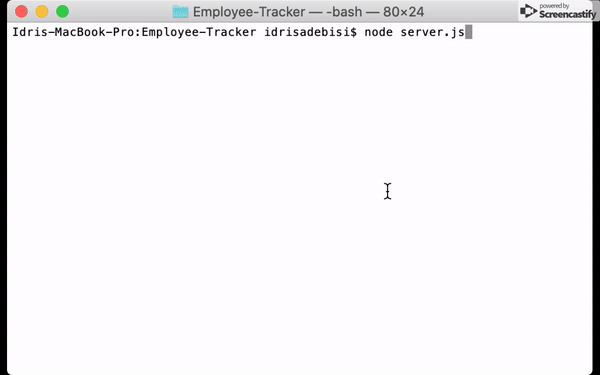
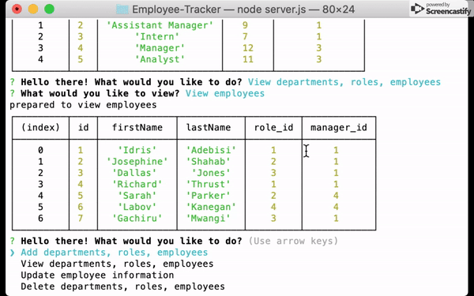

# Employee-Tracker

This command line application serves as a solution for managing a company's employees using node, inquirer, and MySQL. 
Users are able to:

  * Add departments, roles, employees

  * View departments, roles, employees

  * Update employee roles

  * Update employee managers

  * View employees by manager

  * Delete departments, roles, and employees.
  
  See sample use in below gifs:
  
  .md add in 
  .md add in 
